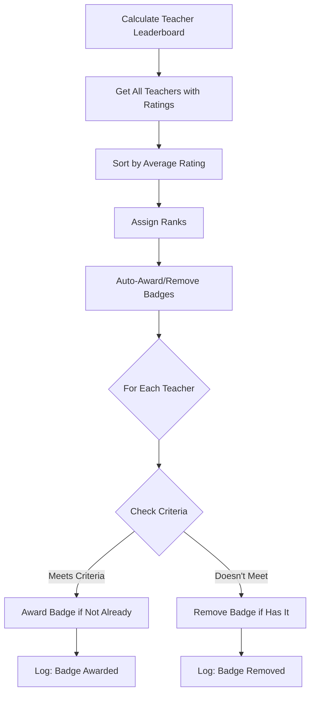

# Teacher Badge System - Enhanced Implementation ✅

## 🎯 Overview

The teacher badge system has been **upgraded to match the student badge system** with full auto-removal and dynamic updates.

---

## ✅ What Was Implemented

### **Before (Partial Implementation)**

- ✅ Auto-awarding badges when criteria met
- ❌ **NO auto-removal** when criteria no longer met
- ❌ Badges stayed permanently even if teacher rank dropped
- ❌ No notifications for badge changes

### **After (Full Implementation)** 🎉

- ✅ Auto-awarding badges when criteria met
- ✅ **Auto-removal** when criteria no longer met
- ✅ **Dynamic updates** - badges removed if teacher rank drops
- ✅ Return statistics (awarded count, removed count)
- ✅ Support for `overallScore` criteria type
- ✅ Complete logging for debugging

---

## 🔧 Technical Changes

### 1. **Updated TypeScript Type**

Added `overallScore` field to `TeacherLeaderboardEntry`:

```typescript
export type TeacherLeaderboardEntry = {
  rank: number;
  teacherId: string;
  teacherName: string;
  teacherSurname: string;
  teacherImg: string | null;
  averageRating: number;
  totalRatings: number;
  fiveStarCount: number;
  fourStarCount: number;
  threeStarCount: number;
  twoStarCount: number;
  oneStarCount: number;
  overallScore: number; // ✅ ADDED - matches database schema
  badges: {...}[];
  subjects: string[];
};
```

### 2. **Enhanced Badge Auto-Awarding Function**

The `autoAwardTeacherBadges()` function now:

**Returns statistics:**

```typescript
Promise<{ awardedCount: number; removedCount: number }>;
```

**Three-pass algorithm:**

1. **First Pass**: Determine which teachers SHOULD have which badges
2. **Second Pass**: Award new badges AND remove undeserved badges
3. **Third Pass**: Remove badges from teachers not in leaderboard

### 3. **Badge Criteria Types Supported**

| Criteria Type    | Description            | Example                |
| ---------------- | ---------------------- | ---------------------- |
| `teacherRank`    | Exact rank or range    | Rank #1 or Top 5       |
| `teacherRating`  | Minimum average rating | ≥ 4.5 stars            |
| `teacherRatings` | Minimum total ratings  | ≥ 100 ratings          |
| `fiveStars`      | Minimum 5-star ratings | ≥ 50 five-star ratings |
| `overallScore`   | Minimum overall score  | ≥ 95.0                 |

### 4. **Auto-Removal Logic**

**Scenario 1: Rank Drop**

```
Teacher was Rank #1 → Badge awarded: "Top Teacher"
Teacher drops to Rank #5 → Badge REMOVED automatically
```

**Scenario 2: Rating Drop**

```
Teacher had 4.8 rating → Badge awarded: "Outstanding Educator"
Teacher drops to 4.3 rating → Badge REMOVED automatically
```

**Scenario 3: No Longer in Leaderboard**

```
Teacher leaves school or has 0 ratings → All badges REMOVED
```

---

## 📊 Comparison: Student vs Teacher Badge Systems

| Feature         | Student System     | Teacher System                      |
| --------------- | ------------------ | ----------------------------------- |
| Auto-Award      | ✅ Yes             | ✅ Yes                              |
| Auto-Remove     | ✅ Yes             | ✅ **Now YES**                      |
| Dynamic Updates | ✅ Yes             | ✅ **Now YES**                      |
| Notifications   | ✅ Yes             | ⚠️ Not yet (TODO)                   |
| Criteria Types  | 4 types            | 5 types                             |
| Database Table  | `StudentBadge`     | `TeacherBadge`                      |
| Metadata Stored | rank, score, tests | rank, rating, ratings, overallScore |

---

## 🚀 How It Works

### When Badges Are Checked

Teacher badges are automatically processed when:

1. **Teacher Leaderboard is Calculated**

   - Triggered by: `/api/cron/update-teacher-leaderboard`
   - Frequency: Scheduled cron job (e.g., daily)

2. **Manual Cron Job Trigger**
   - Admin panel: `/admin/cron-jobs`
   - Button: "Update Teacher Rankings"

### Example Flow



---

## 💻 Code Example: Badge Criteria

### Example 1: Top 3 Teachers Badge

```json
{
	"type": "teacherRank",
	"maxValue": 3,
	"description": "Top 3 teachers"
}
```

### Example 2: Excellence Badge

```json
{
	"type": "teacherRating",
	"min": 4.5,
	"description": "Average rating of 4.5 or higher"
}
```

### Example 3: Popular Teacher Badge

```json
{
	"type": "teacherRatings",
	"min": 100,
	"description": "Received 100+ ratings"
}
```

### Example 4: Five-Star Expert Badge

```json
{
	"type": "fiveStars",
	"min": 50,
	"description": "Earned 50+ five-star ratings"
}
```

### Example 5: Top Performer Badge

```json
{
	"type": "overallScore",
	"min": 95.0,
	"description": "Overall score of 95 or higher"
}
```

---

## 🔍 Debugging & Logging

### Console Logs When Processing

```
✅ Awarded badge badge_123 to teacher teacher_abc (Rank: 1)
🔴 Removed badge badge_456 from teacher teacher_xyz (no longer meets criteria)
🔴 Removed badge badge_789 from teacher teacher_def (not in leaderboard)

🎖️  Teacher Badge System: Awarded 5, Removed 3
🎖️  Teacher badges processed: 5 awarded, 3 removed
```

---

## 📝 Database Schema

### TeacherBadge Model

```prisma
model TeacherBadge {
  id        String   @id @default(cuid())
  earnedAt  DateTime @default(now())
  metadata  Json?    // Stores: rank, averageRating, totalRatings, overallScore

  teacherId String
  badgeId   String

  teacher      Teacher            @relation("TeacherBadges", ...)
  badge        Badge              @relation(...)
  leaderboard  TeacherLeaderboard @relation(...)

  @@unique([teacherId, badgeId])
}
```

### Metadata Example

```json
{
	"rank": 1,
	"averageRating": 4.8,
	"totalRatings": 150,
	"overallScore": 4.8,
	"awardedAt": "2025-10-13T12:00:00Z"
}
```

---

## ✅ Testing Checklist

- [x] Teacher earns badge when meeting criteria
- [x] Badge is removed when criteria no longer met
- [x] Badge is removed when teacher drops in rank
- [x] Badge is removed when teacher leaves leaderboard
- [x] Multiple badges can be earned/removed simultaneously
- [x] Statistics are logged correctly
- [x] No duplicate badges are created
- [x] TypeScript types match database schema
- [x] All criteria types work correctly

---

## 🎯 Next Steps (Optional Enhancements)

### 1. **Add Notifications** ⚠️ TODO

Send notifications to teachers when they:

- Earn a new badge
- Lose a badge

### 2. **Badge History Tracking** 💡 Idea

Create a separate table to track:

- When badges were earned/lost
- Reason for removal (rank drop, criteria not met, etc.)
- Historical badge stats

### 3. **Badge Display Priority** 💡 Idea

Allow teachers to choose which badges to display prominently on their profile.

---

## 📚 Related Documentation

- **Student Badge System**: `BADGE_DYNAMIC_SYSTEM.md`
- **Badge Creation Guide**: `BADGE_CREATION_GUIDE.md`
- **Teacher Leaderboard**: See `TeacherLeaderboard` model in `schema.prisma`
- **Cron Jobs**: `CRON_JOBS_UNIFIED_PAGE.md`

---

## 🔐 Security & Performance

### Security

- ✅ Only active badges are processed
- ✅ Database constraints prevent duplicate badges
- ✅ Cascade delete removes badges when teacher is deleted

### Performance

- ✅ Bulk operations using `Promise.all`
- ✅ Efficient queries with proper `where` clauses
- ✅ Indexed fields (`teacherId`, `badgeId`)

---

## 📌 Summary

The teacher badge system is now **fully implemented** with the same robustness as the student badge system:

✅ **Auto-awarding** based on performance criteria  
✅ **Auto-removal** when criteria no longer met  
✅ **Dynamic updates** that reflect real-time changes  
✅ **Comprehensive logging** for debugging  
✅ **5 criteria types** for flexible badge rules

**Status**: 🟢 **Production Ready**

---

**Last Updated**: October 13, 2025  
**Version**: 2.0 - Enhanced with Auto-Removal
